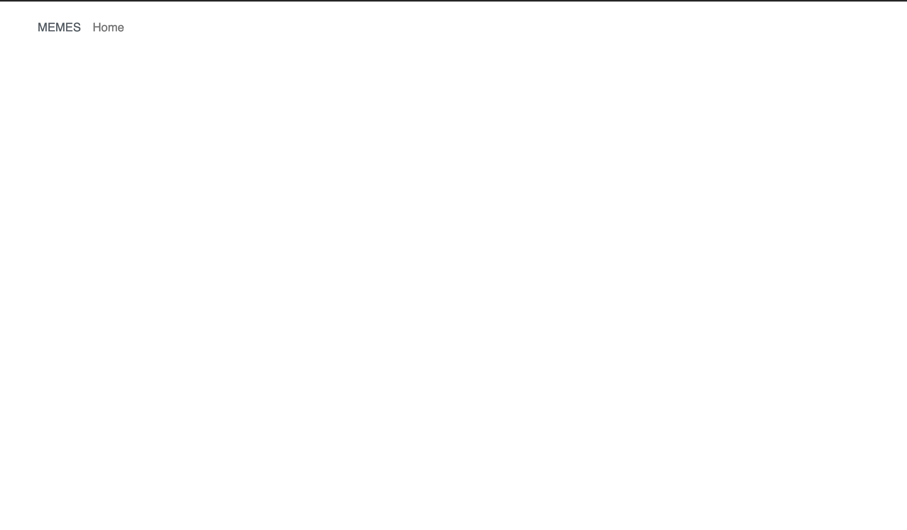
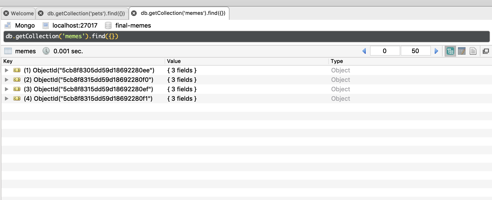
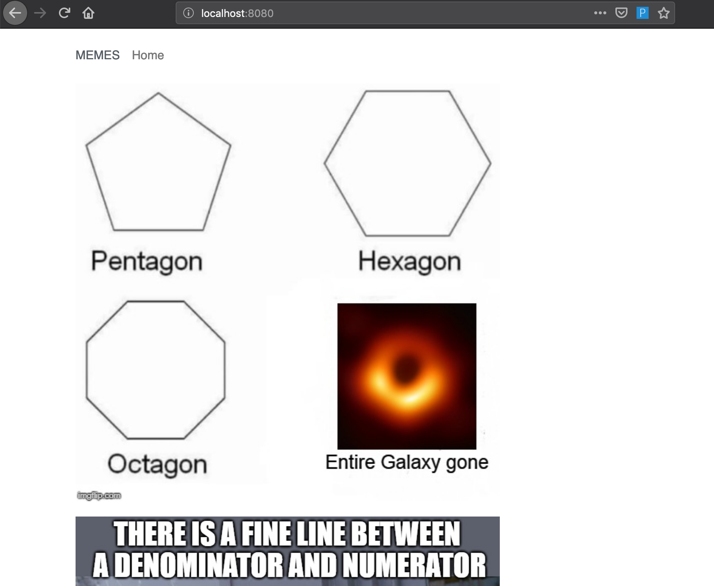
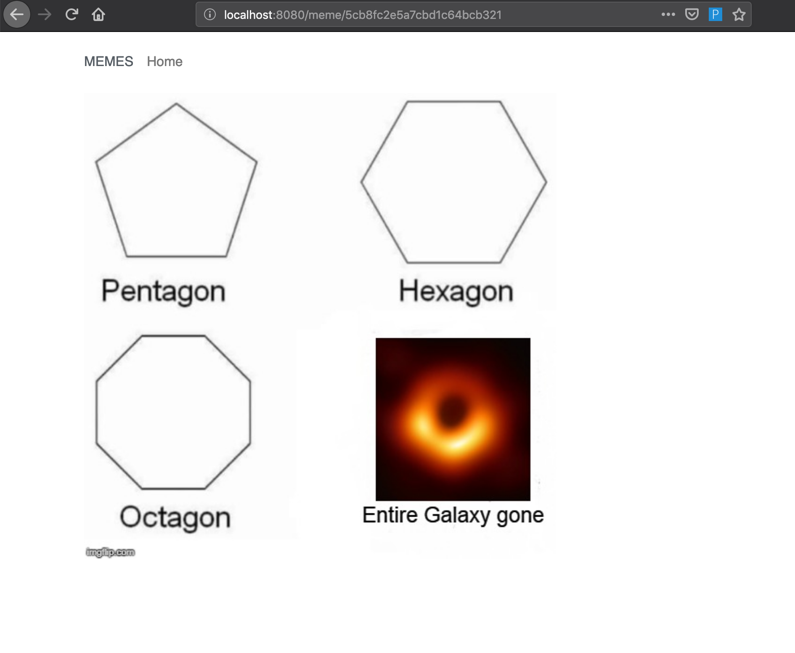

# Memes

This problem focuses on the Vue CLI.

## Overview of the Application

The Memes app is a simple application for displaying memes. To
run this code, you will need to install Node packages:

```
npm install
```

Then run the webpack development server in one terminal:

```
npm run serve
```

and the Node server in another terminal:

```
node server.js
```

You can visit the app in your browser at `localhost:8080`.

This application has a back end with a REST API in `server.js`. It also has a
front end in `public/index.html` and `src`. When you start up the application,
it should look like this;



## Database Schema and Model

The database has one model, Meme, whose schema consists of:

- path: a string, the path to the image
- created: a date, set to now as the default

## REST API

The REST API implemented by the server consists of the following:

- GET /api/memes

  - gets all memes entries, sorted by their path

- GET /api/memes/:id

  - gets a single meme, given in the "id" portion of the URL

- POST /api/memes
  - creates a new meme
  - the body must contain a path for the image

## Data

I have provided some sample data to load into the database. Be sure your
database is running and the Node server is running. Then, run the following
command:

`node data.js`

You can verify this data is loaded with RoboMongo:



## Tasks

Build the front end for the home page and a meme page.

- The home page should display all memes. They do not need to be displayed in a
  grid, but you should use a simple vertical layout. You do not need to
  use Vuex -- the component you write can simply use axios to call the back end.

- When you click on the image for a meme, the application should display a
  separate page for this meme. When you reload the page, that same meme should
  be displayed. The URL for this page should be `/meme/ID`, where `ID` is
  the ObjectId of that meme in the database.

- Both pages should have reasonably good styling, following the web design
  guidelines discussed in class.

The last image shown is my message to you at the end of this semester. :-)

When done, your app should look like this:




## Grading

This problem is worth 15 points. Grading will be based on this rubric:

| Item      | Points    |
| --------- | --------- |
| Home Page | 5 points  |
| Meme Page | 10 points |

Partial Credit for each part: 50% if solid effort but not close to working, 80%
if solid effort and close to working.
