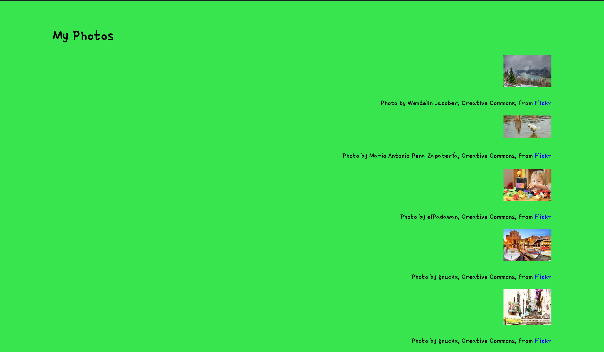

# My Photos

This problem focuses on CSS.

## Overview of the Application

The My Photos app is a simple application for displaying a set of photos. To run
this code, you will need to use a Python server:

```
python3 -m http.server
```

Alternatively, for Python 2:

```
python -m SimpleHTTPServer
```

Your syntax may vary slightly.

You can visit the app in your browser at `localhost:8000`.

This application has HTML in `index.html`, CSS in `styles.css`, and Vue using
Vue in `script.js`. The Vue code is very simple -- it just has a hard-coded set
of photos. The application should look like this:



## Task

Modify the My Photos HTML and CSS to improve the design of the page.

- You should pick a color scheme from `color.adobe.com` or some other site.
  Document which color scheme you use by leaving a comment at the top of
  `styles.css`.

- Follow the design principles we learned to develop a usable site. You may
  modify `index.html` and `styles.css` as needed.

Be sure to allocate your time carefully -- getting CSS right can take some
time.

## Grading

This problem is worth 25 points. Grading will be based on:

| Item        |
| ----------- |
| Spacing     |
| Typography  |
| Color       |
| Consistency |
| Creativity  |

Grades will be awarded as:

| Item      | Grade     |
| --------- | --------- |
| Excellent | 25 points |
| Very Good | 20 points |
| Average   | 15 points |
| Poor      | 10 points |
